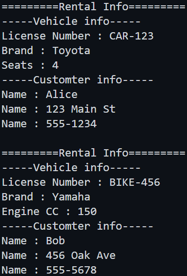

## 🧠 OOP Design Question – Vehicle Rental System (Java Only)

Design a **Vehicle Rental System** using core **Object-Oriented Programming** principles. Your task is to model a system where customers can rent vehicles (cars or bikes), and the system will calculate rental costs and associate customer profiles.

### Cost per day
 - Bike : $20
 - Car : $50

This system must demonstrate the following OOP concepts:

---

### ✅ Requirements (with Descriptions, Attributes, and Method Signatures):

---

### 1. **Abstraction**

Create an abstract class `Vehicle` that defines shared properties and declares a method to calculate rental cost:

```java
abstract class Vehicle implements Rentable{
    protected String licenseNumber;
    protected String brand;

    public abstract double calculateRentalCost(int days);

    // Getters | Setters | Constructor as you need

    // `displayInfo` method
}
```

---

### 2. **Inheritance**

Create concrete classes `Car` and `Bike` that inherit from `Vehicle` and implement a `Rentable` interface.

```java
class Car extends Vehicle{
    private int seats;

    // Getters | Setters | Constructor as you need

    // `displayInfo` method
    
}

class Bike extends Vehicle{
    private int cc;

    // Getters | Setters | Constructor as you need

    // `displayInfo` method
}
```

---

### 3. **Interface**

Define a `Rentable` interface that will be implemented by both `Car` and `Bike`:

```java
interface Rentable {
    void rentTo(Customer customer, int days);
}
```

---

### 4. **Composition**

Create a `Profile` class to store user details. The `Customer` class should contain a `Profile` object:

```java
class Profile {
    private String name;
    private String address;
    private String phone;

    // Getters | Setters | Constructor as you need
}

class Customer {
    private Profile profile;
    
    // Getters | Setters | Constructor as you need

    // `displayInfo` method
}

```

---

### 🎯 Task:

- Implement all required classes in a **single Java file**.
- Demonstrate the OOP concepts explicitly:
  - Abstraction (`Vehicle`)
  - Inheritance (`Car`, `Bike`)
  - Interface (`Rentable`)
  - Composition (`Customer` → `Profile`)


## main method

- use below main method

```java
// Main class
public class Main {
    public static void main(String[] args) {
        // Create profiles and customers
        Profile p1 = new Profile("Alice", "123 Main St", "555-1234");
        Customer c1 = new Customer(p1);

        Profile p2 = new Profile("Bob", "456 Oak Ave", "555-5678");
        Customer c2 = new Customer(p2);

        // Create vehicles
        Car car = new Car("CAR-123", "Toyota", 4);
        Bike bike = new Bike("BIKE-456", "Yamaha", 150);

        // Rent vehicles
        car.rentTo(c1, 5);

        bike.rentTo(c2, 4);
    }
}
```


## 🌟 Expected Ouput
  
